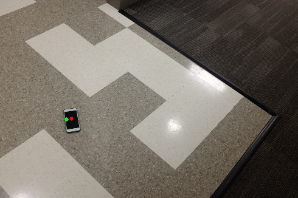

# Object Location Pinner
This project performed center estimation of a object in various background using my modified CNN. 
My model is modified from AlexNet, a heatmap is generated to decide the whether 
object in the heatmap and attention loss is generated with softmax function.  
Model is trained with attention loss and classification loss to pinpoint the location of object. 
I got around 83% of accuracy with my tool dataset with this model    
To train the model: 
```bash
python train_location_pinner.py ~/sample_dataset
``` 
To test the model, it will output the predicted location and image with center overlays: 
```bash
python pin_location.py sample/example.jpg
``` 
output overlay result:  
  
green dot is predicted center point of the object and the red dot is labeled center point of the object  
  
Please feel free to fork this repo, and please kindly star this repo if you find it useful :)


